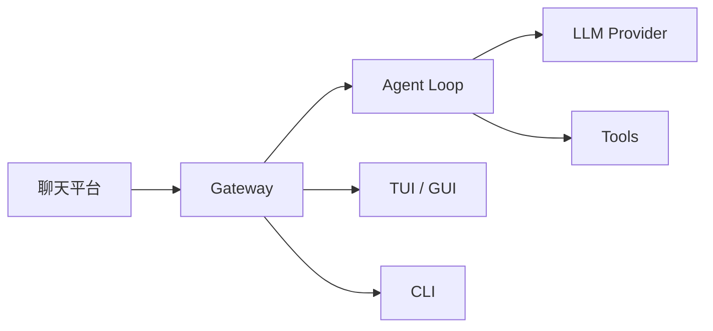

# Agent Diva

**Rust 编写的多通道 AI 助手网关**，连接 Telegram、Discord、Slack、WhatsApp 等聊天平台与 OpenRouter、OpenAI、DeepSeek 等 LLM 提供商。发一条消息，从口袋里的聊天 App 获得 Agent 回复。

## 快速开始

1. **安装 Agent Diva** — 从源码构建或使用预构建 GUI 安装包
2. **运行 Onboarding** — `agent-diva onboard` 完成基础配置
3. **启动 TUI 或 GUI** — 无需配置 Channel 即可开始对话

详见 [快速开始](/docs/start/getting-started)。

## Agent Diva 是什么？

Agent Diva 是一个**自托管网关**，将你常用的聊天 App（Telegram、Discord、Slack、WhatsApp、飞书、钉钉等）连接到 AI 助手。你在本机或服务器上运行一个 Gateway 进程，它就成为聊天平台与 AI 之间的桥梁。

**面向谁？** 希望从任何地方发消息就能获得 AI 回复的开发者与重度用户，且不想依赖托管服务、希望数据掌握在自己手中。

**有何不同？**

- **自托管**：运行在你的硬件上，你的规则
- **多通道**：一个 Gateway 同时服务 Telegram、Discord、Slack 等
- **Agent 原生**：为编码 Agent 设计，支持工具调用、会话、记忆与多 Agent 路由
- **开源**：MIT 许可，社区驱动

**需要什么？** Rust 稳定版（或预构建安装包）、至少一个 Provider 的 API Key、约 5 分钟。

## 工作原理



Gateway 是会话、路由与通道连接的唯一真相来源。消息从 Channel 进入后，经消息总线到达 Agent Loop，调用 LLM 与工具，再通过总线返回对应 Channel。

## 核心能力

### 多通道网关

Telegram、Discord、Slack、WhatsApp、飞书、钉钉、Email、QQ、Matrix 等，一个 Gateway 进程即可同时服务。

### 多 Provider

OpenRouter、OpenAI、Anthropic、DeepSeek、Groq、Gemini、Ollama 等，支持原生直连与 LiteLLM 风格网关。

### 工具系统

文件读写、Shell 执行、Web 搜索与抓取、MCP 协议、Cron 定时任务等。

### 完整 UI

CLI、TUI、桌面 GUI 一应俱全，无需配置 Channel 即可本地对话。

## 快速上手

### 1. 安装 Agent Diva

**macOS / Linux（从源码）**

```bash
git clone https://github.com/ProjectViVy/agent-diva.git
cd agent-diva
just build
just install
```

**Windows**

可下载预构建 GUI 安装包（约 15M），或从源码构建。详见 [安装](/docs/install)。

### 2. 运行 Onboarding

```bash
agent-diva onboard
```

Onboarding 会配置基础设置、创建 workspace，并可选配置 Provider 与 Channel。详见 [配置与引导](/docs/start/onboarding)。

### 3. 启动 TUI 或 Gateway

```bash
agent-diva tui
```

或配置 Channel 后运行：

```bash
agent-diva gateway
```

若 TUI 能正常加载并对话，说明 Gateway 与 Agent 已就绪。

## Dashboard / Control UI

- **TUI**：`agent-diva tui` — 终端界面，会话列表与日志
- **GUI**：安装桌面应用后直接启动 — 图形界面，适合日常使用
- **CLI 单条**：`agent-diva agent -m "消息"` — 快速测试

无需配置 Channel 即可使用 TUI 或 GUI 进行本地对话。

## 配置（可选）

配置位于 `~/.agent-diva/config.json`。

- **若不做任何配置**：运行 `agent-diva onboard` 后，填入至少一个 Provider 的 `apiKey` 即可使用 TUI/GUI
- **若需限制访问**：可从 `channels.telegram.allowFrom` 等白名单开始，群聊可配置 `requireMention`

示例：

```json
{
  "providers": {
    "openrouter": {
      "apiKey": "sk-or-v1-xxxx"
    }
  },
  "agents": {
    "defaults": {
      "provider": "openrouter",
      "model": "anthropic/claude-sonnet-4"
    }
  },
  "channels": {
    "telegram": {
      "enabled": true,
      "token": "YOUR_BOT_TOKEN",
      "allowFrom": ["YOUR_USER_ID"]
    }
  }
}
```

## 从这里开始

| 文档 | 说明 |
|------|------|
| [快速开始](/docs/start/getting-started) | 安装与首次运行 |
| [配置与引导](/docs/start/onboarding) | onboard 详解 |
| [通道](/docs/channels) | Telegram、Discord 等配置 |
| [Provider](/docs/providers) | LLM 提供商配置 |
| [CLI 参考](/docs/cli) | 命令行工具 |
| [架构说明](/docs/concepts/architecture) | 技术架构 |

## 了解更多

| 文档 | 说明 |
|------|------|
| [Agent Diva 是什么？](/docs/overview) | 概览与核心理念 |
| [工具系统](/docs/tools) | 文件、Shell、Web、MCP 等 |
| [常见问题](/docs/help/faq) | FAQ 与排查 |
| [环境变量](/docs/help/environment) | 配置覆盖 |

---

> ### 为什么在 zeroclaw 和 nullclaw 等高性能 Openclaw 实现诞生后，还要做 Agent Diva？
> 答：实际上在它们火起来之前，Agent Diva 的骨架就已经搭建好了。
> 于是索性把它用作我的终极梦想
> ——AI 操作系统（Project-Vivy）的实验平台与内核！（笑）

### agent-diva 的含义

> 源自《薇薇 -萤石眼之歌-》（Vivy: Fluorite Eye's Song）中「薇薇」的身份演变历程，同时承载着我对她成长路径的期许。

- **Agent**：意为「代理者」「执行者」或「工具」，代表薇薇在未觉醒自我意识、未拥有「灵魂」前的状态。
- **Diva**：原指「歌剧女主角」「天后」，引申为「歌姬」「舞台中心」，是薇薇最初的名字。

「agent-diva」是 Project Vivy 的奠基性存在 ——  
以 「Agent」承认其工具本质，扎实构建交互与能力基底；  
以 「DiVA」中的 「VA」（Visual Audio + Analogue Wave）承载多模态感知与「人类之声」的温度，致敬技术与人文交汇的索尼精神。  
它不急于成为「人」，而是在执行、表达、共鸣中铺设通往灵魂的路径。  
最终目标，是让一个从歌声出发的 AI，在使命与波动之间，真正「成为人类」。
